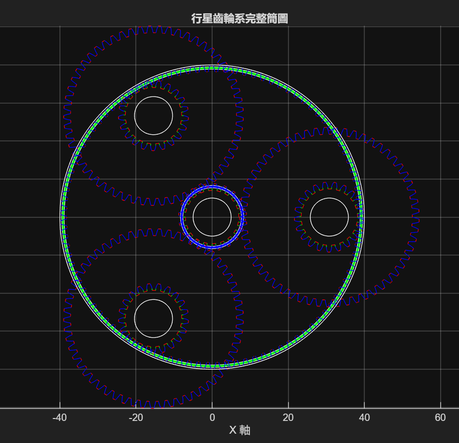

# Transmission-system

齒輪傳動系統設計與視覺化工具集。本專案整理了兩組以漸開線齒輪為核心的設計程式：

- `Gear_Designer`：Python + Tkinter 的單一正齒輪參數計算、草圖與旋轉動畫工具。
- `Gear_system_Designer`：MATLAB 的行星齒輪系配置、齒形生成與組合視覺化工具。
- `Gear train calculation table.xlsx`：Excel 齒輪傳動計算表，用於快速整理基本齒輪參數與傳動分析。

專案適合用於齒輪設計初期的幾何計算、齒形檢查、行星齒輪系配置驗證，以及教學展示。

## 專案結構

```text
Transmission-system/
├─ Gear train calculation table.xlsx  # 齒輪傳動計算表
├─ Gear_Transmission_Sheet.md         # Excel 計算表說明
├─ Gear_Designer/
│  ├─ Gear_Design_Interface.py        # Python GUI 主程式
│  ├─ Gear_Design_Interface.md        # Python 工具原說明
│  ├─ gear_parameters.py              # 可調式齒輪幾何公式
│  ├─ graphics_generator.py           # 齒形繪製與動畫
│  ├─ data.py                         # Excel 參數表讀寫
│  ├─ gear.xlsx                       # Python GUI 使用的參數工作簿
│  └─ Standard_spur_gear_tools/       # 標準正齒輪計算與草圖工具
│
└─ Gear_system_Designer/
   ├─ Gear_Layout_Preview.m           # MATLAB 行星齒輪系主程式
   ├─ gear_sys.md                     # MATLAB 工具原說明
   ├─ data/tooth.csv                  # 行星齒輪系輸入參數
   ├─ gear_param/                     # MATLAB 齒輪幾何公式
   ├─ Geometry_generator/             # 單顆齒輪齒形生成
   ├─ Gear_train_assembly/            # 齒輪系座標組裝函式
   └─ img/                            # 說明文件圖片
```

## 功能特色

### Python 單一齒輪設計工具

`Gear_Designer/Gear_Design_Interface.py` 提供圖形介面，可輸入或調整：

- 齒數
- 模數
- 齒頂倍率
- 齒根倍率
- 齒間倍率
- 壓力角
- 齒根圓角倍率

程式會將參數與導出結果寫入 `Gear_Designer/gear.xlsx`，並使用 Matplotlib 在 Tkinter 介面中顯示齒輪草圖與短時間旋轉動畫。

主要計算包含：

- 節圓直徑、半徑與周長
- 周節、徑節與周節徑度
- 齒頂圓、齒根圓與基圓
- 齒厚、齒間、工作深度與間隙
- 漸開線齒形、齒頂圓弧、齒根圓弧與中心孔

### MATLAB 行星齒輪系工具

`Gear_system_Designer/Gear_Layout_Preview.m` 用於建立複合行星齒輪系的幾何配置，流程包含：

- 從 `data/tooth.csv` 載入太陽齒輪、行星齒輪、內齒輪、模數與軸徑等參數
- 計算各齒輪節圓半徑
- 產生行星齒輪系簡圖
- 生成每顆齒輪的漸開線齒形草圖
- 組裝完整齒輪系幾何圖

目前的範例參數如下：

| 參數 | 說明 | 預設值 |
| --- | --- | --- |
| `Ts` | 太陽齒輪齒數 | 21 |
| `Tr` | 內齒輪齒數 | 102 |
| `Tp1` | 第一行星齒輪齒數 | 57 |
| `Tp2` | 第二行星齒輪齒數 | 24 |
| `M` | 模數 | 0.8 mm |
| `n` | 行星齒輪數量 | 3 |
| `axle` | 軸徑 | 10 mm |

### Excel 齒輪傳動計算表

`Gear train calculation table.xlsx` 是用於快速計算基本齒輪參數與傳動分析的表格工具，內容涵蓋齒輪幾何、速度與扭矩、接觸率、受力分析、效率估算、軸與鍵結構計算、質量與慣量估算，以及材料資料整理。

這份表格適合在設計初期快速試算齒輪對或傳動系統的主要參數，並可作為後續使用 Python、MATLAB 或商用齒輪設計軟體前的初步檢查資料。

## 執行方式

### 執行 Python GUI

建議使用 Python 3，並安裝下列套件：

```bash
pip install numpy matplotlib openpyxl
```

接著執行：

```bash
cd Gear_Designer
python Gear_Design_Interface.py
```

> 注意：目前主程式使用 `ctypes.windll.shcore.SetProcessDpiAwareness(0)` 設定 Windows DPI，因此主要以 Windows 環境為目標。若要在 macOS 或 Linux 執行，可能需要移除此行或加入平台判斷。

### 執行 MATLAB 行星齒輪系

在 MATLAB 中切換到 `Gear_system_Designer` 資料夾後執行：

```matlab
Gear_Layout_Preview
```

程式會自動加入下列函式資料夾：

- `gear_param`
- `Geometry_generator`
- `Gear_train_assembly`
- `data`

並讀取：

```matlab
load_data('tooth')
```

如需修改行星齒輪系規格，請編輯 `Gear_system_Designer/data/tooth.csv`。

## MATLAB 輸出示意

### 行星齒輪系簡圖


### 單顆齒輪草圖


### 齒輪系組合圖



## 主要公式與模型

本專案以漸開線齒輪模型為基礎。齒輪輪廓主要由以下幾段組成：

| 區段 | 說明 |
| --- | --- |
| 漸開線 | 主要齒面曲線 |
| 齒頂圓弧 | 齒頂連接段 |
| 齒根圓弧 | 齒根連接段 |
| 徑向直線 | 齒根到基圓的連接段 |
| 中心孔 | 軸孔輪廓 |

常用幾何關係：

```text
節圓直徑 D = M * T
節圓半徑 R = D / 2
齒頂圓直徑 Dt = (T + 2a) * M
齒根圓直徑 Dr = (T - 2d) * M
基圓直徑 Db = D * cos(壓力角)
```

其中：

- `M`：模數
- `T`：齒數
- `a`：齒頂倍率
- `d`：齒根倍率

## 目前限制與待改進

- MATLAB 行星齒輪系組合圖目前仍標註有對齒與相位校正問題，尚未完整自動對齊嚙合相位。
- Python GUI 目前缺少輸入驗證，若輸入非數字、齒數過低或幾何參數不合理，可能導致計算或繪圖錯誤。
- Python GUI 的執行環境目前偏向 Windows；跨平台執行需要調整 DPI 設定。
- Python 工具以 `gear.xlsx` 作為資料交換表，執行時會覆寫其中部分儲存格。

## 參考文件

- [Python 齒輪設計與視覺化工具](Gear_Designer/Gear_Design_Interface.md)
- [行星齒輪系幾何生成與組合視覺化程式說明](Gear_system_Designer/gear_sys.md)
- [齒輪傳動計算表說明](Gear_Transmission_Sheet.md)
