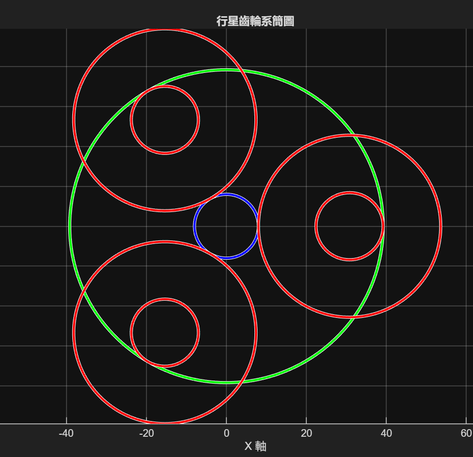
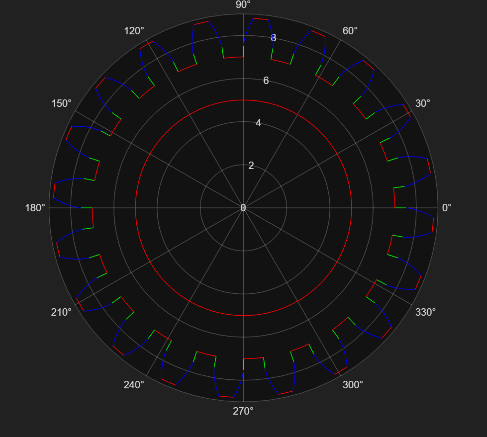
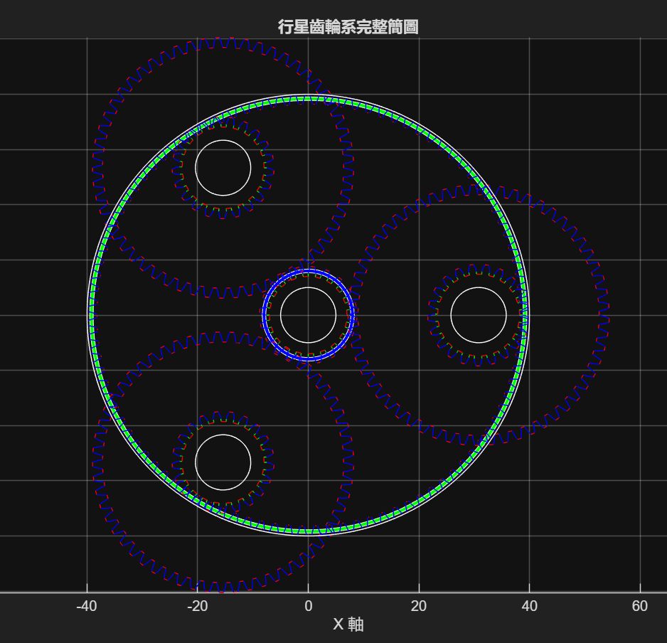

# 行星齒輪系幾何生成與組合視覺化程式說明
* [檔案位置](../Gear_system_Designer/)
本程式用於 **建立、計算與視覺化行星齒輪系統的幾何配置**。  

1. 齒輪基本參數輸入與整理
2. 計算齒輪節圓半徑
3. 建立行星齒輪系簡圖
4. 繪製齒輪草圖
5. 組裝完整齒輪系幾何圖

此程式主要用於 **行星齒輪系統設計初期的幾何驗證與配置檢查**。


## 1 程式初始化
### 匯入工具函式庫

```matlab
addpath('Gear_system_Designer'); % 輸出工具集合
addpath('Gear_system_Designer/gear_param'); % 21個齒輪參數計算函式
addpath('Gear_system_Designer/Geometry_generator/'); % 7個齒極座標輪曲線繪製函式
addpath('Gear_system_Designer/Gear_train_assembly/'); % 8個xy座標齒輪齒型繪製函式
addpath('data') % 齒輪數據資料庫
```

| 模組                  | 功能       |
| ------------------- | -------- |
| gear_param          | 齒輪基本幾何計算 |
| Geometry_generator  | 齒形與草圖生成  |
| Gear_train_assembly | 齒輪系組裝    |
| data                | 參數資料     |

### 讀取齒輪參數

```matlab
load_data('tooth')
```
| 參數       | 說明    |
| -------- | ----- |
| $M$      | 模數    |
| $n$      | 行星齒輪數 |
| $T_s$    | 太陽輪齒數 |
| $T_{p1}$ | 第一行星齒 |
| $T_{p2}$ | 第二行星齒 |
| $T_r$    | 內齒輪齒數 |

---

### 齒輪名稱

```matlab
gear_names = {'太陽齒輪', '行星齒輪', '行星齒輪2', '內齒輪'};
```

### 齒數設定

```matlab
T_values = [Ts, Tp1, Tp2, Tr];
```

### 軸孔直徑設定

```matlab
ad = [10,10,10,tip_diameter(M, Tr)];
```

## 2 輸出資訊
* 齒輪基本資料
* 齒輪系簡圖
* 各齒輪草圖
* 行星齒輪系組合圖

### 齒輪系簡圖

$$
R = \frac{T M}{2}
$$


太陽齒輪中心位於：

$$
(0,0)
$$
行星齒輪平均分佈：

$$
\theta = \frac{2\pi}{n}
$$

第 $k$ 顆行星齒輪：

$$
x_k = (R_s + R_p)\cos(k\theta)
$$

$$
y_k = (R_s + R_p)\sin(k\theta)
$$


此處為 **複合行星齒輪 (compound planet gear)**
兩顆齒輪共用同一中心。

### 各齒輪草圖生成


生成每一顆齒輪的 **齒形草圖**。

* 漸開線齒形
* 齒頂圓
* 齒根圓
* 徑向直線
* 軸孔

### 齒輪系組合圖

可用於：

* CAD設計前檢查
* 幾何驗證
* 機構展示

## 3 待改進部分
目前 **齒輪相位尚未完全對齊**。

未來可加入：

* 相位匹配演算法
* 齒輪嚙合角度校正
* 自動調整初始角度
